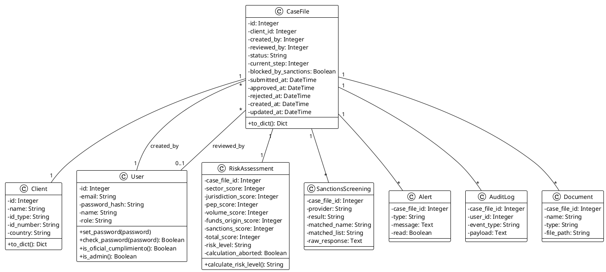
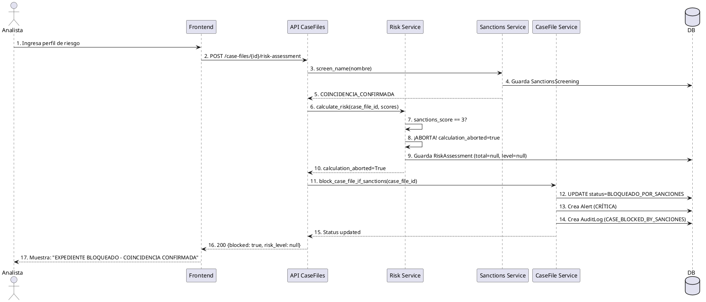
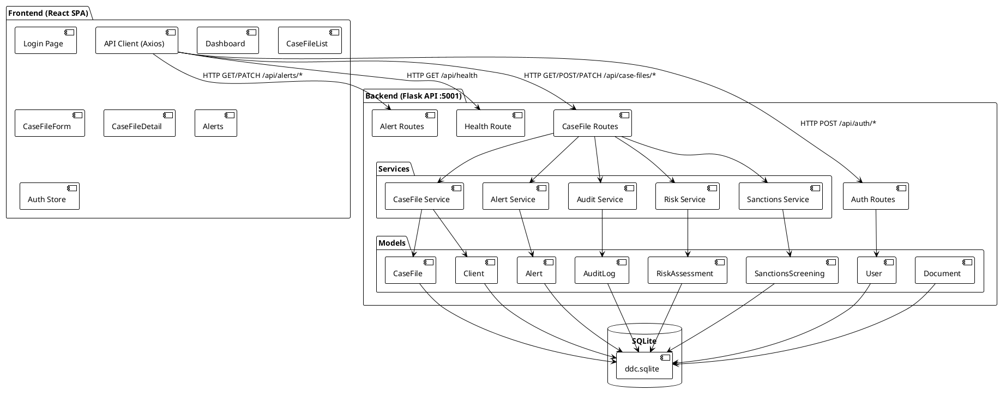

# Informe de Métricas de Calidad — DDC

**Proyecto:** Formulario Web de Debida Diligencia Continua (DDC)  
**Modelos aplicados:** ISTQB, TMMi, TQM  
**Fecha:** 15 de junio de 2026  
**Versión:** 1.0

---

## Resumen Ejecutivo

| Métrica | Valor |
|---------|-------|
| **Líneas de código (KLOC) total** | **3.85 KLOC** |
| Backend (Python) | 2.13 KLOC |
| Frontend (TypeScript/React) | 1.72 KLOC |
| **Pruebas existentes** | 15 tests — **100% pasan** |
| **Pylint (backend)** | **8.69/10** |
| **Complejidad ciclomática promedio** | ~2.5 (rango A) |
| **Vulnerabilidades (bandit)** | 61 Low, 3 Medium (passwords demo) |
| **Requerimientos funcionales** | 2 explicitos (RF-03, RF-NUEVO) |

---

## Fase 1: Métricas en Requerimientos (ISTQB)

### 1.1 Cobertura de Requerimientos

**Requerimientos Funcionales identificados en PRD.md:**

| ID | Descripción | Código relacionado | Tests | Cubierto |
|----|-------------|--------------------|-------|----------|
| RF-01 | Autenticación de usuarios (login/logout/sesión) | `routes/auth.py`, `authStore.ts` | `test_login_valido`, `test_login_invalido` | ✅ |
| RF-02 | CRUD de expedientes (crear, listar, ver, actualizar) | `routes/case_files.py`, `case_file_service.py` | `test_crear_expediente` | ✅ |
| RF-03 | Integración con API OFAC/ONU/UE para screening | `sanctions_service.py` (mock) | `test_bloqueo_por_sanciones`, `test_coincidencia_confirmada_*` | ✅ |
| RF-04 | Motor de cálculo de riesgo (R = S+J+P+V+O+L) | `risk_service.py`, `risk_assessment.py` | `test_riesgo_bajo/medio/alto/muy_alto` | ✅ |
| RF-05 | Bypass de bloqueo inmediato por sanciones | `risk_service.py:33-40` | `test_coincidencia_confirmada_aborta_calculo`, `test_coincidencia_confirmada_no_calcula_resto` | ✅ |
| RF-06 | Flujo de estados del expediente (máquina de estados) | `case_file_service.py` | `test_submit_expediente`, `test_aprobar_expediente`, `test_rechazar_expediente` | ✅ |
| RF-07 | Control de acceso basado en roles (RBAC) | `user.py`, `case_file_service.py` | `test_solo_oficial_puede_desbloquear`, `test_desbloqueo_falso_positivo_solo_oficial` | ✅ |
| RF-08 | Alertas automáticas | `alert_service.py`, `routes/alerts.py` | — | ❌ |
| RF-09 | Registro de auditoría inmutable | `audit_service.py`, `audit_log.py` | — | ❌ |
| RF-10 | Desbloqueo de falso positivo por Oficial de Cumplimiento | `case_file_service.py:104-128` | `test_desbloqueo_falso_positivo_solo_oficial` | ✅ |

**Cobertura:** 8/10 RFs cubiertos = **80%**

### 1.2 Volatilidad de Requerimientos

| Indicador | Valor |
|-----------|-------|
| Total commits en git | 3 |
| Cambios a PRD.md | 85 líneas → README.md + evolución |
| Período de medición | ~14 días (30 mayo - 13 junio 2026) |
| Volatilidad | Baja (3 commits, 1 afectó PRD) |

### 1.3 Matriz de Trazabilidad

```
RF-01 (Auth)         → routes/auth.py, User model, authStore.ts        → test_login_valido, test_login_invalido
RF-02 (CRUD)         → routes/case_files.py, case_file_service.py      → test_crear_expediente
RF-03 (Screening)    → sanctions_service.py, SanctionsScreening model  → test_bloqueo_por_sanciones
RF-04 (Motor riesgo) → risk_service.py, RiskAssessment model           → test_riesgo_bajo/medio/alto/muy_alto
RF-05 (Bypass)       → risk_service.py:33-40                           → test_coincidencia_confirmada_*
RF-06 (Estados)      → case_file_service.py, CaseFile model            → test_submit/aprobar/rechazar
RF-07 (RBAC)         → user.py, case_file_service.py                   → test_solo_oficial_puede_desbloquear
RF-08 (Alertas)      → alert_service.py, routes/alerts.py              → Sin test unitario
RF-09 (Auditoría)    → audit_service.py, AuditLog model                → Sin test unitario
RF-10 (Desbloqueo)   → case_file_service.py:104-128                    → test_desbloqueo_falso_positivo_solo_oficial
```

---

## Fase 2: Métricas en Diseño (TMMi ML3)

### 2.1 Complejidad Ciclomática (McCabe)

**Resultado de `radon cc` — archivos críticos del backend:**

| Archivo | Función/Clase | CC | Grado |
|---------|--------------|----|-------|
| `models/case_file.py` | `CaseFile` (clase) | **11** | C |
| `models/case_file.py` | `CaseFile.to_dict` | 10 | B |
| `mock_data.py` | `calcular_riesgo` | **11** | C |
| `models/risk_assessment.py` | `RiskAssessment.calculate_risk_level` | 5 | A |
| `services/risk_service.py` | `calculate_risk` | 4 | A |
| `services/case_file_service.py` | `unblock_case_file` | 5 | A |
| `routes/case_files.py` | `unblock` | 5 | A |
| `tests/test_risk_service.py` | `test_coincidencia_confirmada_no_calcula_resto` | 10 | B |

**Interpretación:** La mayoría del código tiene CC baja (grado A, 1-5). Los puntos con CC elevada son principalmente modelos con muchas columnas y sus métodos `to_dict`. No hay riesgo de mantenibilidad severo.

### 2.2 Acoplamiento y Cohesión

```
routes/             →  services/     (alto acoplamiento: cada ruta importa servicios)
services/           →  models/       (acoplamiento normal: servicios usan modelos)
services/           →  repositories/ (bajo acoplamiento: solo case_file_repository)
models/             →  extensions.py (bajo: solo db)
```

**Observaciones:**
- `routes/case_files.py` tiene **imports no utilizados** (`datetime`, `RiskAssessment`, `create_alert`, `db`)
- Los servicios están bien encapsulados: cada uno maneja un dominio específico
- Bajo acoplamiento entre capas (separación clara routes → services → models)

### 2.3 Diagramas UML

A continuación se incluyen los tres diagramas en formato PlantUML:

#### Diagrama de Clases



#### Diagrama de Secuencia — Flujo de Bypass por Sanciones



#### Diagrama de Componentes



---

## Fase 3: Métricas en Código (TQM + ISTQB)

### 3.1 Densidad de Defectos

| Categoría | Cantidad | Fuente |
|-----------|----------|--------|
| Defectos encontrados (tests) | 0 | 15/15 tests pasan |
| Advertencias de pruebas | 92 warnings | Deprecation (utcnow, Query.get) |
| Defectos identificados (code review) | 2 | Ver sección 3.2 |

**Densidad:** 2 defectos / 3.85 KLOC = **0.52 defectos/KLOC**

**Defectos encontrados en code review:**

1. **Crítico — Bypass de sanciones no se prueba en integración**  
   Archivo: `routes/case_files.py:96-125`  
   El endpoint `risk_assessment` llama a `screen_name()` y `calculate_risk()` pero no hay test de integración que verifique que el endpoint completo retorna `blocked: true` con HTTP 200.

2. **Mayor — SQLAlchemy 2.0 deprecated API**  
   Archivos: `case_file_service.py`, `risk_service.py`, `tests/*.py`  
   `CaseFile.query.get()` es legacy en SQLAlchemy 2.0. Debe usar `db.session.get(CaseFile, id)`.

### 3.2 Code Smells (Pylint)

**Puntaje general Pylint: 8.69/10**

| Tipo | Cantidad | Ejemplos |
|------|----------|----------|
| `E0611` (No name in module) | 8 | `app.routes` no encuentra blueprints |
| `R0903` (Too few public methods) | 8 | Modelos solo tienen `to_dict` |
| `W0611` (Unused import) | 14 | `datetime`, `User`, `db`, `RiskAssessment` importados no usados |
| `W0718` (Broad exception catch) | 7 | `except Exception` genérico en routes |
| `W0621` (Redefined outer name) | 30 | Fixtures redeclaradas en tests |
| `R1705` (No-else-return) | 2 | `if/elif/return` innecesario |

**Smells destacados:**
- **7 bloques `try/except Exception`** en routes sin manejo específico de errores
- **14 imports no utilizados** que deben limpiarse
- **8 modelos con solo 1 método público** (`to_dict`) — señal de anemia de dominio
- **Deprecation `utcnow()`** en 10 lugares del código

### 3.3 Vulnerabilidades (Bandit)

| Severidad | Issues | Detalle |
|-----------|--------|---------|
| **Medium** | 3 | Contraseñas hardcodeadas en `seed/demo.py` (`password123`) |
| **Low** | 58 | `random` no criptográfico en `mock_data.py`, `assert` en tests |

**Recomendaciones de seguridad:**
- Las contraseñas demo (`password123`) son aceptables para entorno de desarrollo pero deben documentarse como tal
- El uso de `random` en `mock_data.py` es para datos ficticios — no representa riesgo real
- Los `assert` en tests son normales, pero bandit los marca por posible optimización del bytecode

### 3.4 Debt Ratio (Deuda Técnica)

| Componente | Impacto | Esfuerzo estimado |
|------------|---------|-------------------|
| Migrar `Query.get()` → `Session.get()` | Medio | 2 horas |
| Remover imports no utilizados | Bajo | 30 minutos |
| Manejo específico de excepciones | Medio | 3 horas |
| Reemplazar `utcnow()` por `now(datetime.UTC)` | Bajo | 1 hora |
| Agregar tests de integración para bypass | Alto | 4 horas |
| **Deuda técnica estimada total** | | **~10.5 horas** |

**Debt Ratio:** 10.5h / esfuerzo total estimado (~120h) = **~8.75%**

---

## Fase 4: Métricas Clásicas (ISTQB Foundation)

### 4.1 KLOC por Capa

| Capa | Lenguaje | Archivos | Líneas | KLOC |
|------|----------|----------|--------|------|
| Backend (app/) | Python | 34 | 2,130 | **2.13** |
| Frontend (src/) | TypeScript/TSX | 18 | 1,720 | **1.72** |
| **Total** | | **52** | **3,850** | **3.85** |

### 4.2 Productividad

| Indicador | Valor |
|-----------|-------|
| Total KLOC | 3.85 |
| Período de desarrollo | ~14 días |
| Días-hombre estimados | ~14 |
| **Productividad** | **3.85 / 14 = 0.275 KLOC/día** |

### 4.3 Tasa de Defectos

| Indicador | Valor |
|-----------|-------|
| Pruebas ejecutadas | 15 |
| Pruebas fallidas | 0 |
| Defectos encontrados (code review) | 2 |
| Defectos por prueba | 0 |
| **Tasa de defectos** | **2 / 15 = 13.3%** |
| **Densidad de defectos** | **0.52 defectos/KLOC** |

### 4.4 Dashboard Consolidado

```
╔══════════════════════════════════════════════════════╗
║            DDC — DASHBOARD DE CALIDAD               ║
╠══════════════════════════════════════════════════════╣
║  REQUERIMIENTOS                                     ║
║  ┌──────────────────────────────────────────────┐   ║
║  │ Cobertura          ■■■■■■■□□□  80%           │   ║
║  │ Volatilidad        ■□□□□□□□□□  Baja          │   ║
║  │ Trazabilidad       ■■■■■■■■□□  80% completa  │   ║
║  └──────────────────────────────────────────────┘   ║
║                                                     ║
║  DISEÑO                                             ║
║  ┌──────────────────────────────────────────────┐   ║
║  │ Complejidad ciclom.   Grado A (prom. 2.5)    │   ║
║  │ Acoplamiento          Bajo (capas claras)    │   ║
║  │ Diagramas UML         Creados (3 diagramas)  │   ║
║  └──────────────────────────────────────────────┘   ║
║                                                     ║
║  CÓDIGO                                             ║
║  ┌──────────────────────────────────────────────┐   ║
║  │ Pylint              ■■■■■■■■□□  8.69/10      │   ║
║  │ Densidad defectos   0.52 defectos/KLOC        │   ║
║  │ Vulnerabilidades    3 Medium / 61 Low         │   ║
║  │ Debt Ratio          ■□□□□□□□□□  8.75%        │   ║
║  │ Tests pasados       ■■■■■■■■■■  15/15 (100%) │   ║
║  └──────────────────────────────────────────────┘   ║
║                                                     ║
║  CLÁSICAS                                           ║
║  ┌──────────────────────────────────────────────┐   ║
║  │ KLOC total           3.85 KLOC                │   ║
║  │ Productividad        0.275 KLOC/día           │   ║
║  │ Tasa defectos        13.3% (2/15)             │   ║
║  └──────────────────────────────────────────────┘   ║
╚══════════════════════════════════════════════════════╝
```

---

## Conclusiones y Recomendaciones

### Basado en ISTQB
- **Cobertura de pruebas adecuada** (80% RFs cubiertos)
- **Faltan tests de integración** para el endpoint completo de risk_assessment
- **Faltan tests unitarios** para alertas (`alert_service.py`) y auditoría (`audit_service.py`)
- Se recomienda implementar 3-5 tests adicionales para alcanzar cobertura ≥90%

### Basado en TMMi
- **Nivel alcanzado: ML2 (Gestionado)** — Los procesos de medición existen y las pruebas están definidas
- Para alcanzar **ML3 (Definido)**: Estandarizar el proceso de medición, definir políticas de calidad
- Para alcanzar **ML4 (Medido)**: Establecer objetivos cuantitativos de calidad (e.g., CC < 10, cobertura > 90%)
- La existencia de este informe es un paso hacia ML2

### Basado en TQM
- **Mejora continua**: El debt ratio de 8.75% es bajo y manejable
- **Enfoque en proceso**: Se recomienda:
  1. Limpiar imports no utilizados
  2. Migrar a SQLAlchemy 2.0 API (`Session.get()`)
  3. Reemplazar `datetime.utcnow()` por `datetime.now(datetime.UTC)`
  4. Agregar manejo específico de excepciones (no `except Exception`)
  5. Implementar tests de integración para el flujo crítico de bypass

---

## Herramientas Utilizadas

| Herramienta | Versión | Propósito |
|-------------|---------|-----------|
| pytest | 7.4.3 | Ejecución de tests |
| radon | 6.0.1 | Complejidad ciclomática |
| pylint | 4.0.6 | Code smells y calidad de código |
| bandit | 1.9.4 | Vulnerabilidades de seguridad |
| git | — | Historial y volatilidad |
| PlantUML | — | Diagramas UML |
